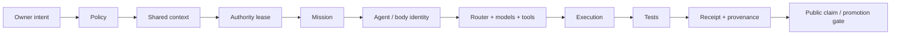

<div align="center">

# ♾️×♾️ ©️8x8 by FlashTM8 ⚡️🌎🤖

### One Fabric for evidence-governed human + AI systems

**Past preserved · Present proven · Future gated**

[](https://github.com/8x8org/8x8-user-edition)
[](https://github.com/8x8org/.github)
[](https://github.com/8x8org/8x8-protocol)
[](../SECURITY.md)

[**Open Public Fabric**](https://8x8-os-ecosystem.vercel.app) · [**Explore User Edition**](https://github.com/8x8org/8x8-user-edition) · [**Review Protocol**](https://github.com/8x8org/8x8-protocol) · [**Public Program**](https://github.com/orgs/8x8org/projects/1)

</div>

---

## One system. One root. Verifiable autonomy.

8x8 is an evidence-governed operating architecture for coordinating humans, agents, models, tools, devices, workflows, memory and public experiences without collapsing authority, history or proof into a black box.

The canonical public architecture resolves under one root:

```text
fabric://8x8/core
```

The core execution chain is deliberately legible:



The objective is not merely autonomous output. The objective is **bounded, reversible, inspectable, evidence-backed autonomy**.

---

## The three realities

| Reality | Operating meaning | Promotion law |
|---|---|---|
| **PAST_PRESERVED** | Historical releases, dormant capabilities, evidence, experiments and rollback material are retained with provenance. | Never erase history merely because newer work exists. |
| **PRESENT_PROVEN** | Current claims require reproducible evidence for the exact object/revision being described. | Proof outranks prose. |
| **FUTURE_GATED** | Research, candidates, simulations and integrations remain explicitly unpromoted until their gates pass. | Newer is not automatically canonical. |

This separation is foundational to One Fabric. A screenshot is not a deployment receipt. A registered agent is not automatically productive. A branch is not a release. A design is not owner-accepted merely because it renders.

---

## The One Fabric architecture

```text
                           ©️8x8 by FlashTM8 ⚡️🌎🤖
                                      │
                             fabric://8x8/core
                                      │
        ┌─────────────────────────────┼─────────────────────────────┐
        │                             │                             │
  Sovereign Fabric             Intelligence Fabric          Continuity Fabric
 owner · identity              agents · councils            memory · messages
 permissions · leases          models · routing             context · evidence
 devices · rollback            research · evaluation        provenance · recovery
        │                             │                             │
        └──────────────────────┬──────┴───────────────┬─────────────┘
                               │                      │
                        Execution Fabric        Experience Fabric
                        missions · services      web · mobile · voice
                        bots · schedulers        spatial · Studio
                        CI · deployments         graphs · operator UX
                               │                      │
                               └──────────┬───────────┘
                                          │
                              Tests → Receipts → Promotion
```

### Five cooperating fabrics

| Fabric | Responsibility |
|---|---|
| **Sovereign** | Owner authority, identity, permissions, devices, leases, emergency control and rollback. |
| **Intelligence** | Agents, councils, model/provider routing, research, teaching and evaluation. |
| **Continuity** | Memory, messages, context, contradiction tracking, provenance, evidence indexes and recovery. |
| **Execution** | Missions, runtimes, services, bots, schedulers, CI, deployment and operational receipts. |
| **Experience** | Public/user clients, graphs, Studio, command decks, mobile cockpit, voice and spatial interfaces. |

---

## What makes 8x8 structurally different

### Evidence is part of the runtime contract

Claims move through an explicit evidence ladder:

```text
CLAIMED
  ↓
DESIGNED
  ↓
IMPLEMENTED
  ↓
TESTED
  ↓
VERIFIED
  ↓
RUNNING
  ↓
DEPLOYED
  ↓
PUBLICLY_RELEASED
  ↓
ADOPTED
```

A claim can move backward when evidence becomes stale. `100/100` is valid only for an explicit denominator, exact scope and timestamp.

### History is an asset, not clutter

Old code, designs, releases and dormant capabilities are preserved, deduplicated and reconciled before revival. The convergence path is:

```text
DISCOVER → INVENTORY → HASH → PROVENANCE → CLASSIFY
→ EXTRACT CAPABILITY → DEDUPLICATE → RECONCILE
→ ASSIGN OWNER → IMPLEMENT REVERSIBLY → TEST → VERIFY
→ RELEASE GATE → DEPLOY → RECEIPT → PROMOTE
```

### Third-party systems are adapters, not new roots

External frameworks, graph systems, model gateways, observability stacks and agent frameworks may contribute powerful capabilities. They enter through bounded adapters and evidence gates; they do not silently replace One Fabric identity, mission, authority, receipt or rollback semantics.

---

## Public product surfaces

| Surface | Purpose | Current public truth |
|---|---|---|
| [**User Edition**](https://github.com/8x8org/8x8-user-edition) | Canonical public-safe client and product source | `0.0.1 Beta` · evidence-gated |
| [**Live Public Fabric**](https://8x8-os-ecosystem.vercel.app) | Public-safe projection of approved surfaces | Reachable public carrier; not the private control plane |
| [**8x8 Protocol**](https://github.com/8x8org/8x8-protocol) | Identity, permission, evidence and compatibility contracts | Protected beta / review |
| **Truth Console / Proof Graph** | Read-only mission, lease, contradiction and receipt inspection | Architecture priority; unified live truth service not yet complete |
| **Studio** | Visual, media, voice, documentation and demonstration system | Mixed Present + Future Lab |
| **Academy / Creator Forge** | Guides, examples, contribution and creation workflows | Planned + partially documented |
| **Blockchain & Testnet Lab** | Provenance, governance and economic experiments | Research/testnet only; no implied financial authority |

---

## Public repositories

| Repository | Role |
|---|---|
| [`8x8-user-edition`](https://github.com/8x8org/8x8-user-edition) | Public-safe product/client surface, cockpit and evidence-oriented experience. |
| [`8x8-protocol`](https://github.com/8x8org/8x8-protocol) | Public permission, identity, receipt and compatibility contracts. |
| [`.github`](https://github.com/8x8org/.github) | Organization governance, public standards, estate projection, receipts and contribution pathways. |

Other connected repositories remain part of the broader One Fabric estate and require role, maturity, security, provenance and public-boundary review before public promotion.

---

## Architecture + research direction

8x8 is deliberately built to absorb useful ideas without losing canonical ownership. Current research families include:

- **context and knowledge graphs** — structured shared memory, temporal state, contradiction detection and provenance;
- **decision intelligence** — first-class decision records, causal context and replayable reasoning evidence;
- **agent orchestration** — identity, mission DAGs, leases, bounded authority and council coordination;
- **universal model routing** — provider/model selection under policy, cost, capability and evidence constraints;
- **multimodal + embodied interfaces** — web, mobile, voice, camera, sensors, 2D/3D/spatial and device nodes;
- **evidence systems** — hashes, receipts, exact-head CI, rollback, deployment truth and public/private boundary enforcement;
- **Studio + visual systems** — high-density command decks, proof graphs, world/mission/memory surfaces and media pipelines;
- **security + cryptographic research** — least privilege, identity, secrets boundaries, provenance and defensive validation.

The design target is not visual spectacle detached from reality. It is **high information density with evidence-linked interaction**, deliberate desktop-to-mobile collapse, strong accessibility/performance and strict separation of live telemetry from decorative or simulated instrumentation.

---

## Start here

| Path | Best for |
|---|---|
| [**Live Public Fabric**](https://8x8-os-ecosystem.vercel.app) | See the currently served public-safe experience. |
| [**User Edition**](https://github.com/8x8org/8x8-user-edition) | Inspect canonical public source and product work. |
| [**Protocol**](https://github.com/8x8org/8x8-protocol) | Review permission, identity, evidence and compatibility contracts. |
| [**Fabric System Map**](../docs/8X8_OS_0.0.1_FABRIC_SYSTEM_MAP.md) | Understand the current public architecture. |
| [**Total Estate Census**](../docs/8X8_TOTAL_ESTATE_CENSUS_0.0.1.md) | Inspect known estate scope and evidence boundaries. |
| [**Public Program**](https://github.com/orgs/8x8org/projects/1) | Follow competition, release and contribution work. |
| [**Discussions**](https://github.com/8x8org/8x8-user-edition/discussions) | Ask questions, challenge architecture and collaborate. |

---

## Contribute where proof matters

High-value contributions include deterministic tests and fixtures, accessibility/mobile review, architecture diagrams, privacy/security review, protocol schemas and validators, public-safe adapters, translations, reproducible benchmark harnesses, issue triage, bug reproduction, and Studio visuals with source/provenance/licensing.

Start with [`CONTRIBUTING.md`](../CONTRIBUTING.md), [`SECURITY.md`](../SECURITY.md), the [open issues](https://github.com/8x8org/8x8-user-edition/issues), [Discussions](https://github.com/8x8org/8x8-user-edition/discussions), and the [Public Program](https://github.com/orgs/8x8org/projects/1).

---

## Public / private boundary

The public organization does **not** publish owner credentials, signing keys or private wallets; raw private prompts/messages/memory; unrestricted device or shell control; private runtime databases; hidden control-plane topology; or autonomous financial authority.

Public clients consume approved capabilities. They are not downloadable replicas of the owner's private system.

---

<div align="center">

### Build the future without falsifying the present.

**©️8x8 by FlashTM8 ⚡️🌎🤖 · One Fabric · Evidence before claims · Rollback before irreversibility**

</div>
